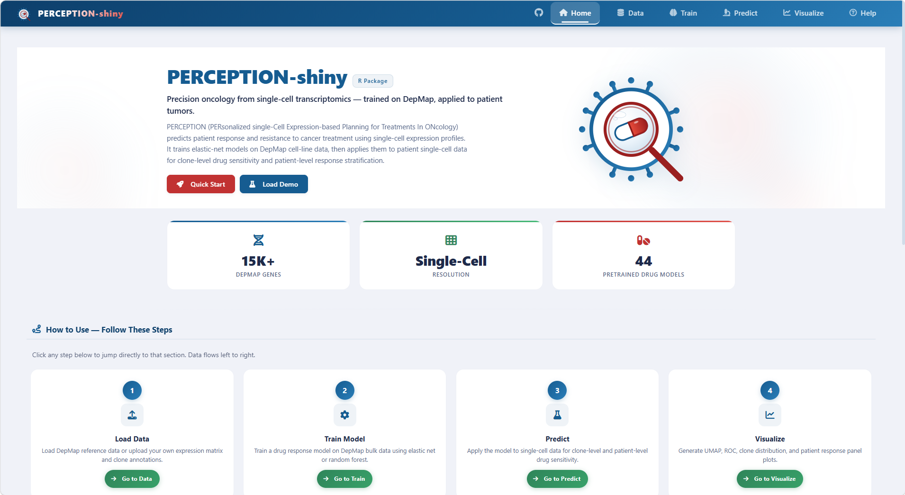
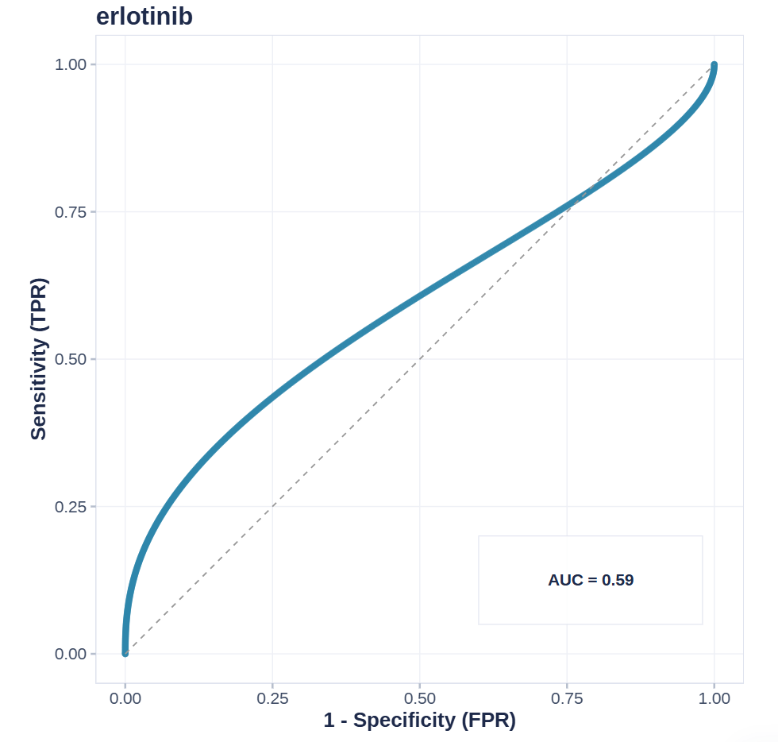
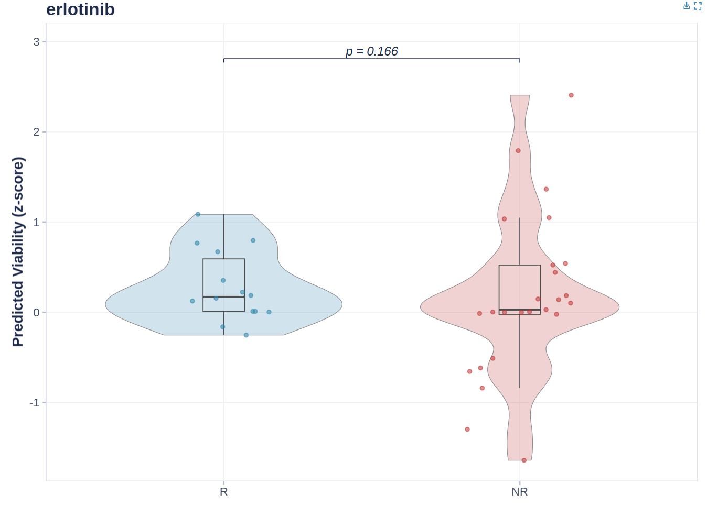
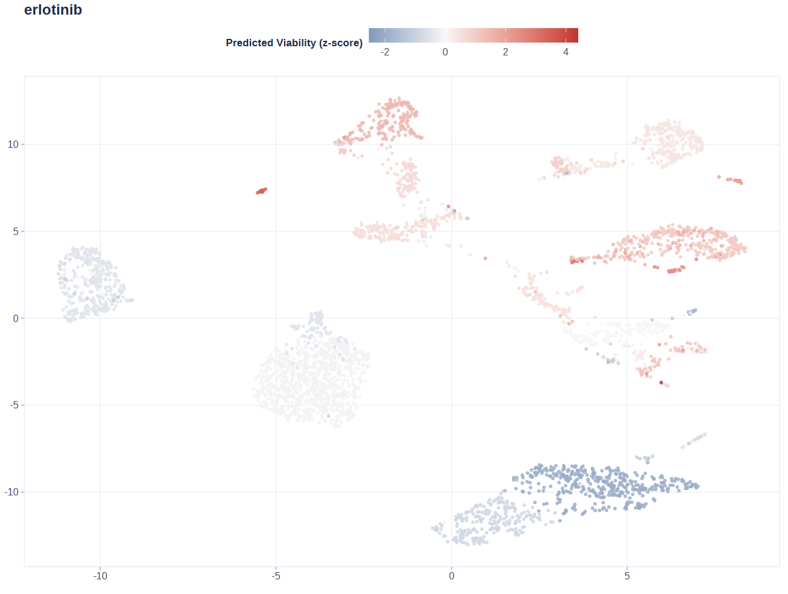

# PERCEPTION-shiny User Guide

## PERCEPTION-shiny User Guide

PERCEPTION-shiny is the web interface of the PERCEPTIONx R package. It
wraps the full analysis pipeline — data loading, model training,
drug-sensitivity prediction, and visualization — into a point-and-click
application. You can go from a patient single-cell expression matrix to
clone-level viability scores and patient-level response stratification
without writing code.

The methodology is PERCEPTION (PERsonalized single-Cell Expression-based
Planning for Treatments In ONcology): elastic-net models are trained on
DepMap cell-line screens, then applied to a patient’s single-cell
profile to predict drug response and resistance.

------------------------------------------------------------------------

### Contents

- [0. Requirements & Launch](#id_0-requirements--launch)

- [1. Interface Overview](#id_1-interface-overview)

- [2. Data Tab: Loading Data](#id_2-data-tab-loading-data)

- [3. Train Tab: Training Models
  (Optional)](#id_3-train-tab-training-models-optional)

- [4. Predict Tab: Predicting Viability
  Scores](#id_4-predict-tab-predicting-viability-scores)

- [5. Visualize Tab](#id_5-visualize-tab)

- [6. Help Tab](#id_6-help-tab)

- [7. FAQ](#id_7-faq)

- [8. Citation & Contact](#id_8-citation--contact)

------------------------------------------------------------------------

### 0. Requirements & Launch

------------------------------------------------------------------------

#### 0.1 Requirements

- R ≥ 4.1.0.

- Main dependencies: `devtools`, `shiny`, `bslib`, `Seurat`, `ggplot2`,
  `ggiraph`, `glmnet`, `caret`, `DT`, `plotly`, `waiter`, `thematic`,
  `callr`, `readxl`. The app prompts you to install anything that is
  missing when a feature needs it.

------------------------------------------------------------------------

#### 0.2 Launch

From the package source root:

``` r

devtools::load_all()          # load PERCEPTIONx from source
run_perception_app()          # launch the app (opens your browser)
```

Or run the app directory directly:

``` r

shiny::runApp("inst/shiny/app")
```

------------------------------------------------------------------------

#### 0.3 Overall Flow

    DepMap reference data ──► Model training ──► Clone/patient prediction ──► Visualization & validation
              ▲                      ▲                    ▲                        ▲
          Data tab              Train tab          Predict tab               Visualize tab
     (or load pre-trained   (or skip training —
       models directly)       use the 44 pre-
                              trained models)

For the fastest result, follow Load Demo → Predict → Visualize. No
training is needed.

A note on the architecture: all heavy computation — model training,
Seurat clustering, prediction, and plot math — runs in background worker
processes, never in the interface. The UI polls the workers and shows
progress, so one user’s large task never freezes anyone else.

- Training with the standard DepMap uses a shared master process: a
  single global background worker holds one in-memory copy of DepMap,
  shared across concurrent jobs on Linux via fork, and exits after 12
  idle hours to release memory. Uploaded DepMap files run in isolated
  per-session workers so a bad upload cannot affect others.

- Clustering, prediction, plots, and Load Demo each run in a light
  per-session worker that writes results back to files the UI picks up.

- Deployment knobs: `PERCEPTION_WORKERS` (shared-pool parallelism,
  default 16) and `PERCEPTION_WORKER_IDLE_MINUTES` (master idle-exit
  minutes, default 720).

------------------------------------------------------------------------

### 1. Interface Overview



PERCEPTION-shiny home page

The home page shown above is the entry point. The top bar has six tabs:
Home, Data, Train, Predict, Visualize, and Help, and the workflow runs
left to right — load data, train or load a model, predict, then
visualize and validate.

On the home page itself you get an introduction, a four-step guide (Load
Data → Train Model → Predict → Visualize; each step jumps to the
matching tab), a live data-status overview, key feature cards, and
citation info. The Quick Start and Load Demo buttons load the demo data
in one click.

------------------------------------------------------------------------

### 2. Data Tab: Loading Data

The Data tab is where everything starts. It loads four kinds of input: a
demo dataset, the DepMap reference, your own expression matrix, and
clinical responses. Each item turns its status badge green once loaded.

Click Load Demo to generate a synthetic dataset on the fly — 49 genes ×
400 cells × 20 patients — that is automatically clustered,
rank-normalized, and used to train demo models. It is a quick way to
smoke-test the whole flow.

------------------------------------------------------------------------

#### 2.1 Loading DepMap Reference Data (required for training)

There are two ways to get the DepMap reference data:

1.  **Download & Load**: downloads the reference set (~567 MB, 15k+
    genes × 1,000+ cell lines) from the official mirror and loads it
    automatically. This is the standard training input and the most
    memory- and disk-hungry step.

2.  **Upload a local .RDS**: if you already have the `DepMap.RDS` file,
    browse to it and it loads automatically.

Memory note: the interface process only reads DepMap metadata (gene
names, drug list, component dimensions — a few hundred KB). The full
multi-GB object is loaded by a background worker in a separate process,
only when training runs, so concurrent users do not each hold an 8 GB
copy.

------------------------------------------------------------------------

#### 2.2 Loading Models

Two ways:

1.  **Download & Load**: one-click download of the 44 FDA-approved
    pre-trained models (for example `abemaciclib`, `erlotinib`,
    `osimertinib`). Multi-selected items each show an × to remove them
    individually.

2.  **Upload a local .RDS**: select a trained model file (from
    [`train_models()`](https://wanglabcsu.github.io/PERCEPTIONx/reference/train_models.md)
    or exported from the Train tab) and it loads automatically.

------------------------------------------------------------------------

#### 2.3 Uploading an Expression Matrix (patient scRNA-seq)

- Accepted formats: CSV / TSV / TXT / Excel (.xlsx / .xls) / RDS.

- Accepted R objects: a numeric matrix or data.frame (genes × cells).
  Seurat objects are not accepted directly — export the matrix first.

- Orientation: genes as rows, cells as columns. If the first column is a
  character column of gene names (common in Excel/CSV exports), it is
  converted to row names automatically.

- Normalization: the expression should be rank-normalized. If you upload
  raw counts, the app can normalize them automatically during
  clustering.

------------------------------------------------------------------------

#### 2.4 Uploading the Cell-to-Patient Map (Mapping)

- Accepted formats: CSV / TSV / TXT / Excel / RDS.

- Required columns: `cell_id` (cell names, matching the expression
  matrix column names) and `patient_id` (the patient each cell belongs
  to). Column names are case-insensitive, so `Patient`, `PATIENT` all
  work.

- Named list RDS: if the RDS is a named list of patient → cell-name
  vector (for example the paper demo’s
  `PRJNA591860_sample_cell_names.RDS`), it is converted to long format
  automatically; empty samples are dropped.

------------------------------------------------------------------------

#### 2.5 Uploading Clinical Responses (Response, optional but recommended)

- Accepted formats: CSV / TSV / TXT / Excel / RDS.

- Required columns: `patient` (must exactly match `patient_id` in the
  Mapping) and `response` (the patient’s true clinical outcome for the
  drug).

- Labels are normalized automatically: `responder` / `responsive` / `r`
  / `sensitive` become Responder; `non-responder` / `nr` / `resistant`
  become Non-responder.

- A check runs on upload: if the patient IDs do not overlap with the
  Mapping at all, a warning is shown.

- Why it is needed: only with true outcomes can you validate predictions
  (ROC curves, responder vs. non-responder boxplots). Skip it if you
  only want prediction scores.

For the paper demo lung cohort (PRJNA591860), you can label patients by
treatment timepoint and keep the groups as-is (TN / RD / PD) without
collapsing them into two classes. When a binary label is needed for the
ROC, choose two groups to compare on the Visualize tab.

------------------------------------------------------------------------

#### 2.6 Clustering (Seurat)

Do not skip this step: clustering defines the cell subpopulations
(“clones”) that downstream prediction and visualization are built on.
Without it, clone-level prediction and clone-level figures have no
input.


Clustering in the Data tab

Choose a clustering method (UMAP or tSNE) and set the parameters shown
in the screenshot above, then run the clustering. The embedding is
displayed with cells colored by cluster. The clustering only defines
clones; prediction then works at the clone level, using each clone’s
mean expression.

| Parameter | Description | Suggested |
|----|----|----|
| Seurat Resolution | clustering resolution; higher = finer clusters | 0.5–1.0 |
| Seurat Dims | number of PCA dimensions used | 10–30 |
| Seurat NFeatures | number of highly variable genes; fixed at 2000 in the app | — |

------------------------------------------------------------------------

### 3. Train Tab: Training Models (Optional)

DepMap reference data must be loaded first; the top of the page tells
you what is missing.

If you only want to predict, you do not need to train — just use the 44
pre-trained models from the Data tab. The Train tab exists for other
drugs, other cancer types, custom gene sets, or inspecting model
performance on the three validation datasets.

------------------------------------------------------------------------

#### 3.1 Parameters

| Parameter | Description |
|----|----|
| Drug Name | free-text input; one drug per line or comma/space-separated (combination regimens supported) |
| Cancer Type (include) | cancer types to include, default PanCan (pan-cancer) |
| Cancer Type (exclude) | cancer types to exclude (to avoid self-validation) |
| Gene Symbols | gene list; leave empty = use all DepMap genes (recommended); paste text or upload .txt/.csv |
| Top k Features | keep the top-k ranked features in the model |
| Algorithm | elastic net `glmnet` (recommended) or random forest `rf` |
| CPU Cores | number of parallel cores |

------------------------------------------------------------------------

#### 3.2 Interpreting the Results

Once training finishes, the Train tab reports four things:

- **Model Summary**: model type and hyperparameters per drug (glmnet
  alpha/lambda, or rf ntree/RMSE).

- **Performance Plot**: model performance curve (threshold
  vs. correlation).

- **Performance Metrics**: prediction–truth Pearson correlation and
  p-value on Bulk, Pseudo-bulk, and Single-cell levels. Higher
  correlation and lower p-value mean a better model.

- **Download Model (.RDS)**: export the trained model, to re-upload
  later on the Data tab.


Validation ROC curve (Train tab)

The validation ROC curve (above) shows how well the trained model
separates responders from non-responders on each of the three validation
cohorts. Every curve is annotated with its AUC: the closer the AUC is to
1, the stronger the clinical stratification. Like the Performance Plot,
it is only available for models trained in the Train tab (or via
[`train_models()`](https://wanglabcsu.github.io/PERCEPTIONx/reference/train_models.md)).
Pre-trained models loaded with
[`load_model()`](https://wanglabcsu.github.io/PERCEPTIONx/reference/load_model.md)
do not carry validation fields; the app will tell you they are not
applicable.

------------------------------------------------------------------------

### 4. Predict Tab: Predicting Viability Scores

Select the loaded models (pre-trained from the Data tab or trained on
the Train tab) and click predict. Prediction runs in two stages:

1.  **Clone-level**: a viability score for every clone × every drug. The
    model outputs viability (survival), so higher = more resistant and
    lower = more sensitive. The prediction heatmap shows raw model
    values; the lollipop plot and UMAP Drug Viability use a z-score
    centered at 0.

2.  **Patient-level**: clone scores are aggregated to patients by clone
    proportion (default `weighted_max`), giving each patient’s
    drug-sensitivity stratification.


Predict tab clones×drugs heatmap

The heatmap above shows the raw predictions for every clone (rows)
against every drug (columns). Darker cells mean lower viability (more
sensitive), brighter cells mean higher viability (more resistant). Hover
any cell for the exact value. The downloadable prediction tables below
the heatmap carry the same numbers.

------------------------------------------------------------------------

### 5. Visualize Tab

This tab turns the predictions into figures, so run a prediction first.
All figures are interactive SVG built on ggiraph: hover any point or bar
to see details (clone id, viability score, proportion, FPR/TPR). The
in-figure toolbar has zoom disabled; export to PNG/PDF via the download
buttons at the top of the page.

------------------------------------------------------------------------

#### 5.1 Clone Distribution (stacked bar chart)


Clone distribution stacked bar chart

The stacked bar chart shows, for each patient, the proportion of each
clone inside the tumor; one color band is one clone. A clone that
dominates a patient’s tumor is a natural candidate for driving that
patient’s response, so this chart is the first place to look for
heterogeneity.

One caveat: clone identity depends on the data source. With global
clustering, the same clone color is genuinely shared across patients.
With clone-level input using per-patient labels (c1/c2/c3), the same
color across patients is only a shared category label, not the same
clone.

------------------------------------------------------------------------

#### 5.2 Clone Viability (lollipop plot)


Clone viability lollipop plot

Each lollipop is one clone of one patient:

- One facet per patient, one lollipop per clone, all samples and all
  clones shown.

- Color is a blue-white-red diverging ramp: blue = predicted sensitive
  (low viability), red = predicted resistant (high viability). The color
  limits adapt to the data, so extreme z-scores keep a real color
  instead of clipping to grey.

- Point size encodes the clone’s proportion in the tumor — the biggest
  balls are the clones that matter most for the patient.

- Within a patient, clones are ordered by proportion descending;
  responders come first when response data is present.

- The y-axis is Predicted Viability (z-score), with a zero line as the
  reference: above zero means resistant, below zero means sensitive.

------------------------------------------------------------------------

#### 5.3 ROC Curve



ROC curve

The ROC curve compares patient-level prediction scores against the true
clinical labels uploaded on the Data tab, and every curve is annotated
with its AUC. An AUC above 0.5 means the model stratifies better than
chance, and values closer to 1 indicate strong clinical separation. If
you predicted with several models, pick a specific one from the dropdown
to view its curve.

------------------------------------------------------------------------

#### 5.4 Response Boxplot (responders vs. non-responders)



Response boxplot (R vs NR)

This boxplot compares the distribution of prediction scores between
Responder and Non-responder groups, with a significance test result
printed above the plot. Clear separation between the two boxes means the
model separates the two groups well and that the score is clinically
meaningful.

------------------------------------------------------------------------

#### 5.5 Model Performance


Model performance plot

This plot lives on the Train tab (it is the Performance Plot from
section 3.2), not on the Visualize tab. It traces how prediction–truth
correlation changes across model thresholds on the validation cohorts. A
curve that stays high and flat across thresholds indicates a stable
model. It requires models trained on the Train tab; it is not applicable
to pre-trained models.

------------------------------------------------------------------------

#### 5.6 Spatial Plots (UMAP / t-SNE)


Gene expression on UMAP

The gene expression view colors every cell by the expression of a single
gene. Values are winsorized to the 5th–95th percentiles and scaled to
\[0, 1\], then shown on a grey-to-red ramp: grey means no or low
expression, red means high expression. Use it to see which cell groups
express the gene highly.



Drug viability on UMAP

The drug viability view colors every cell by its clone’s predicted
viability score, which produces a patchwork of blocks: red blocks are
predicted resistant (high viability), blue blocks are predicted
sensitive (low viability). It shows where the resistant and sensitive
subclones sit in the embedding.


Clone identity on UMAP (global clustering)

The clone identity view colors by clone (cluster) to show the population
structure. It is the reference view that ties the two previous ones
together: when a clone’s territory is red in the viability view and also
red in the gene expression view, that gene and that resistance go
together spatially.

How to read the three views together: if the cells with high gene
expression are also bright (high viability) in the viability view, the
gene’s high expression is positively associated with resistance; if
dark, with sensitivity. Keep in mind that the two color scales are
different, so compare spatial patterns, not absolute values.

------------------------------------------------------------------------

#### 5.7 High-Resolution Download

| Format | Resolution |
|----|----|
| PNG | 600 dpi (Cairo anti-aliased), about 6000 × 4200 px at default size |
| PDF / SVG | Vector, infinitely zoomable, recommended for publication |

------------------------------------------------------------------------

### 6. Help Tab

The Help tab contains built-in documentation covering every tab, the
FAQ, and usage tips. Check it first when you get stuck.

------------------------------------------------------------------------

### 7. FAQ

**Q1: “Maximum upload size exceeded”?**

The upload limit is 1 GB. For larger data, preprocess locally first (for
example subset genes); for DepMap, prefer the Download & Load button,
which downloads on the server side rather than through the browser.

**Q2: Model Performance says performance fields are missing?**

That plot needs validation metrics produced during training. Pre-trained
models
([`load_model()`](https://wanglabcsu.github.io/PERCEPTIONx/reference/load_model.md))
do not carry them. Train on the Train tab first, or load the demo models
on the Data tab.

**Q3: How do I construct the response labels?**

Build a two-column table `patient` / `response`. `patient` must exactly
match `patient_id` in the Mapping. `response` values are normalized
automatically (responder → Responder, and so on). Response labels keep
multiple groups (for example TN/RD/PD) without collapsing timepoints;
when the ROC needs a binary label, pick two groups to compare on the
Visualize tab.

**Q4: Why is a viability score lower than I expected?**

Scores are relative ranks learned from DepMap, not absolute percentages.
The prediction heatmap shows raw model values, while the lollipop plot
and UMAP Drug Viability use a z-score centered at 0. Higher values mean
the most resistant clone in this batch, not an absolute viability
percentage. Clonal heterogeneity and activated resistance pathways both
raise the score.

**Q5: Does data persist after I close the app?**

Yes. DepMap data is cached in a persistent directory (on Windows, the
user data directory; on Linux, set the `PERCEPTIONX_DEPMAP_CACHE_DIR`
environment variable) with a 12-hour unused-expiry mechanism. Files stay
on disk after the app closes; if unused for more than 12 hours, the next
click deletes and re-downloads them.

**Q6: Why does the interface stay responsive during training /
clustering / prediction?**

All heavy computation runs in background worker processes; the interface
only polls and shows progress, so you can keep using other pages while a
big task runs. If a worker ever stops unexpectedly, the app reports
“Background worker stopped” instead of spinning forever — just submit
again.

------------------------------------------------------------------------

### 8. Citation & Contact

If you use this app or package, please cite the original methodology
paper:

> Sinha, S., Vegesna, R., Mukherjee, S. *et al.* PERCEPTION predicts
> patient response and resistance to treatment using single-cell
> transcriptomics of their tumors. *Nature Cancer* 5, 938–952 (2024).
> DOI:
> [10.1038/s43018-024-00756-7](https://doi.org/10.1038/s43018-024-00756-7)

Repository:
[github.com/WangLabCSU/PERCEPTIONx](https://github.com/WangLabCSU/PERCEPTIONx)

Feedback: <jiading682@qq.com>
