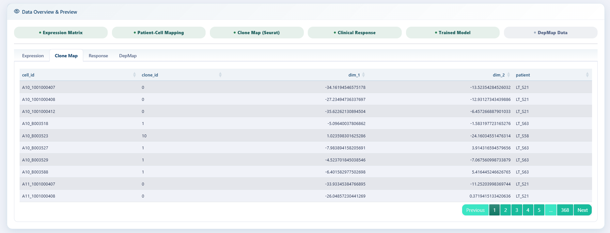
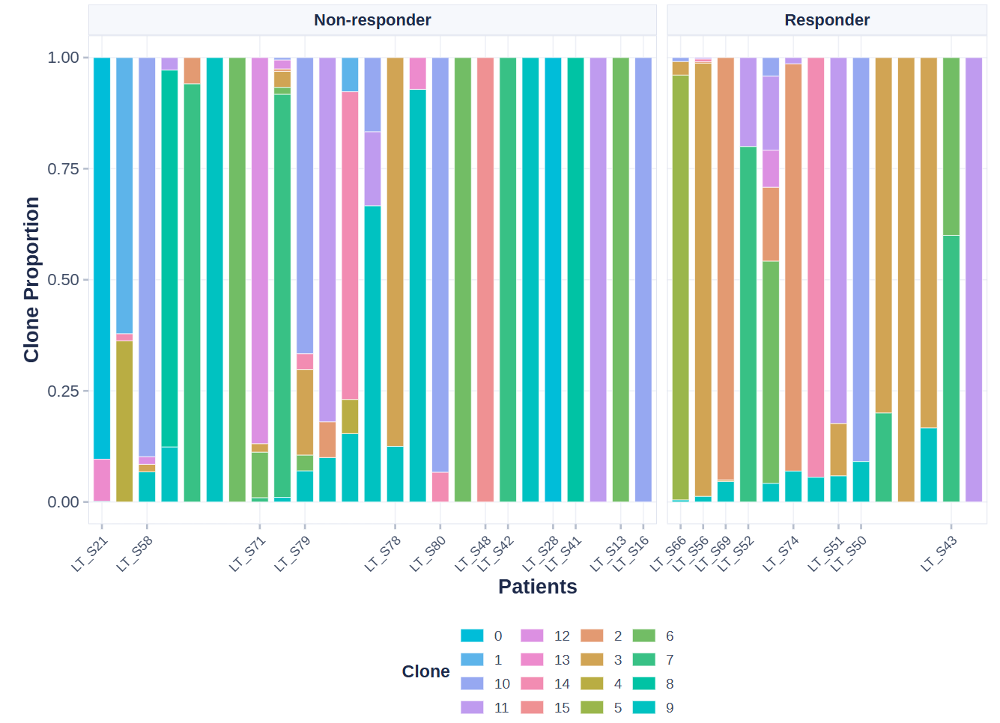
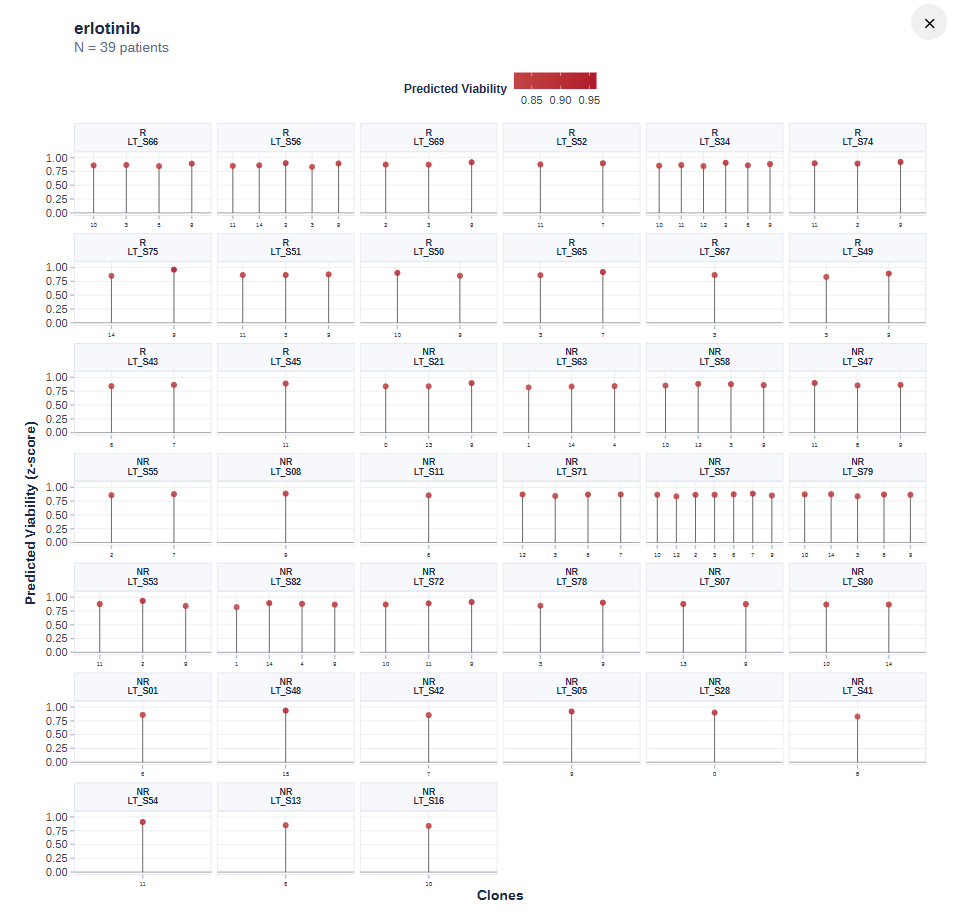
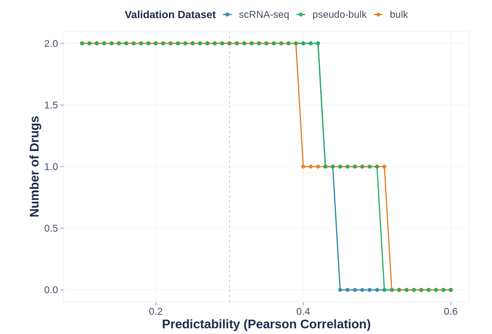
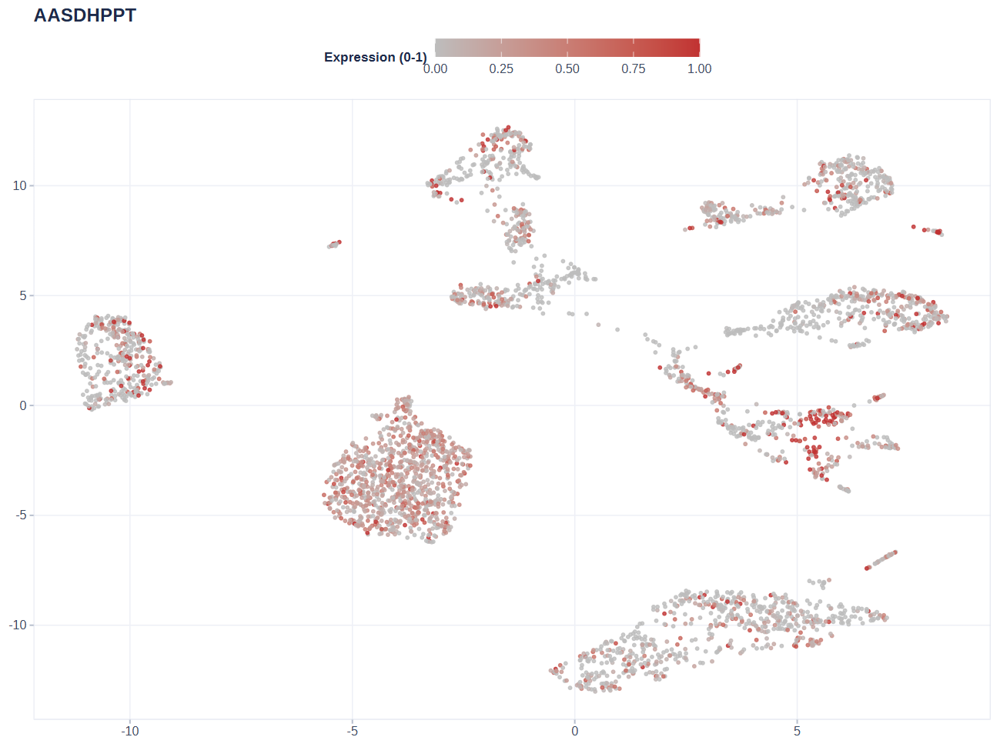

# PERCEPTION-shiny 使用教程

## PERCEPTION-shiny 使用教程

**PERCEPTION-shiny** 是 **PERCEPTIONx** R
包的交互式网页应用（Shiny）。它把完整的分析流水线——数据加载、模型训练、药物敏感性预测、结果可视化——封装成点选式界面，无需写代码即可完成从”患者单细胞表达矩阵”到”克隆级杀伤分数 +
患者级响应分层”的全流程分析。

> 方法学基础：PERCEPTION（PERsonalized single-Cell Expression-based
> Planning for Treatments In ONcology），在 DepMap
> 细胞系数据上训练弹性网络模型，预测患者对药物的响应与耐药。

------------------------------------------------------------------------

### 目录

- [0.
  环境要求与启动](#id_0-%E7%8E%AF%E5%A2%83%E8%A6%81%E6%B1%82%E4%B8%8E%E5%90%AF%E5%8A%A8)

- [1. 界面总览](#id_1-%E7%95%8C%E9%9D%A2%E6%80%BB%E8%A7%88)

- [2. Data
  页：加载数据](#id_2-data-%E9%A1%B5%E5%8A%A0%E8%BD%BD%E6%95%B0%E6%8D%AE)

- [3. Train
  页：训练模型（可选）](#id_3-train-%E9%A1%B5%E8%AE%AD%E7%BB%83%E6%A8%A1%E5%9E%8B%E5%8F%AF%E9%80%89)

- [4. Predict
  页：预测杀伤值](#id_4-predict-%E9%A1%B5%E9%A2%84%E6%B5%8B%E6%9D%80%E4%BC%A4%E5%80%BC)

- [5. Visualize
  页：可视化](#id_5-visualize-%E9%A1%B5%E5%8F%AF%E8%A7%86%E5%8C%96)

- [6. Help 页](#id_6-help-%E9%A1%B5)

- [7. 常见问题（FAQ）](#id_7-%E5%B8%B8%E8%A7%81%E9%97%AE%E9%A2%98faq)

- [8. 引用与联系](#id_8-%E5%BC%95%E7%94%A8%E4%B8%8E%E8%81%94%E7%B3%BB)

------------------------------------------------------------------------

### 0. 环境要求与启动

------------------------------------------------------------------------

#### 0.1 环境要求

- **R** ≥ 4.1.0

- 主要依赖包：`remotes`、`shiny`、`bslib`、`Seurat`、`ggplot2`、`ggiraph`、`glmnet`、`caret`、`DT`、`plotly`、`waiter`、`thematic`、`callr`、`readxl`（缺失时应用会在相应功能处提示安装）

------------------------------------------------------------------------

#### 0.2 启动方式

安装包之后，打开 R/RStudio，运行：

``` r

library(PERCEPTIONx)          # 安装后加载 PERCEPTIONx（详见 pipeline 教程）
run_perception_app()          # 启动应用（自动打开浏览器）
```

或直接运行源码目录中的应用：

``` r

shiny::runApp("inst/shiny/app")
```

------------------------------------------------------------------------

#### 0.3 整体流程

    DepMap 参考数据 ──► 模型训练 ──► 克隆/患者预测 ──► 可视化与验证
          ▲               ▲             ▲                 ▲
       Data 页         Train 页     Predict 页        Visualize 页
    （或直接加载     （或直接用    （选模型后
      预训练模型）    44 药预训练   一键预测）
                     模型，跳过）

> 提示：想最快看到效果，按 **Load Demo → Predict → Visualize**
> 的顺序点击即可，全程不需要训练。

> **异步架构（多用户友好）**：训练、聚类（prepare_data）、预测、绘图等**耗时计算全部在后台独立进程（worker）中执行**，界面进程只负责显示和收发文件，因此一个用户运行大任务时，其他用户的操作完全不受影响。
>
> - **训练**：标准 DepMap 走**共享 master**（全局一个后台进程，加载一份
>   DepMap，Linux 上并行任务共享同一份内存，空闲 12
>   小时自动退出释放内存）；用户上传的 DepMap 走**专属隔离
>   worker**，互不污染。
>
> - **聚类 / 预测 / 绘图 / Load Demo**：每个会话一个轻量 worker
>   处理，计算结果写回文件后界面自动刷新。
>
> - **环境变量**（部署时可选）：`PERCEPTION_WORKERS`（共享池并行任务数，默认
>   16）、`PERCEPTION_WORKER_IDLE_MINUTES`（master 空闲退出分钟数，默认
>   720）。

------------------------------------------------------------------------

### 1. 界面总览


PERCEPTION-shiny 首页

顶部导航栏包含 6
个标签页：**Home、Data、Train、Predict、Visualize、Help**。数据从左向右流动：先加载数据（Data），再训练/加载模型（Train），然后预测（Predict），最后可视化与验证（Visualize）。

首页包含：介绍、四步引导（Load Data → Train Model → Predict →
Visualize，点击可跳转到对应页面）、数据加载状态一览、功能特性与引用信息。页面上的
**Quick Start** 与 **Load Demo** 按钮可一键加载演示数据。

------------------------------------------------------------------------

### 2. Data 模块：加载数据

Data 页是分析的起点，负责加载四种数据：**演示数据 / DepMap 参考数据 /
用户表达矩阵 / 临床响应**。每一项加载成功后，左侧状态徽章会变绿。

> **Load Demo**：
>
> 点击 **Load Demo** 一键生成合成演示数据：**49 个基因 × 400 个细胞 × 20
> 例患者**，并自动完成 Seurat
> 聚类、秩归一化，随后训练演示模型。用于快速测试整个流程，感受各功能页的交互方式。

------------------------------------------------------------------------

#### 2.1 加载 DepMap 参考数据（训练必需）

两种方式：

1.  **Download & Load**：点击按钮自动从官方镜像下载 DepMap 参考集（约
    567 MB，1.5 万+ 基因 × 1,000+
    细胞系），下载完成后自动加载。这是标准训练/参考输入，也是内存和磁盘占用最大的步骤。

2.  **本地上传 .RDS**：如果本地已有 DepMap 文件（`DepMap.RDS`
    格式），直接 Browse 选中即自动加载。

> **关于内存（重要）**：界面进程只读取 DepMap
> 的**元数据**（基因名、药物列表、各组件维度，几百 KB）；完整的多 GB
> 对象由后台 worker
> 在**独立进程**中加载，专供模型训练使用。因此多个用户同时使用也不会每个会话各占一份
> 8 GB 内存（参考架构说明见 0.3 节）。

------------------------------------------------------------------------

#### 2.2 加载模型

两种方式：

1.  **Download & Load**：一键下载 44 种 FDA 批准药物的预训练模型（如
    `abemaciclib`、`erlotinib`、`osimertinib`），多选时每项右侧有 ×
    可单独删除

2.  **本地上传
    .RDS**：选择训练好的模型文件（[`train_models()`](https://wanglabcsu.github.io/PERCEPTIONx/reference/train_models.md)
    或 Train 页导出的 RDS），选中即自动加载

------------------------------------------------------------------------

#### 2.3 上传表达矩阵（患者 scRNA-seq）

- **支持的格式**：CSV / TSV / TXT / Excel（.xlsx/.xls）/ RDS

- **支持的 R 对象**（RDS）：需为数值矩阵或 data.frame（基因 ×
  细胞）；不支持直接传入 Seurat 对象，请先导出为矩阵

- **矩阵方向**：基因 ×
  细胞（行为基因、列为细胞）；若第一列是基因名字符列（Excel/csv
  导出常见），会自动转为行名

- **关于归一化**：表达数据需要是**秩归一化**（rank-normalized）后使用。若上传的是原始计数，勾选后由应用在聚类流程中自动归一化。

------------------------------------------------------------------------

#### 2.4 上传细胞-患者映射（Mapping）

- **支持的格式**：CSV / TSV / TXT / Excel / RDS

- **必须包含两列**：`cell_id`（细胞名，与表达矩阵列名一致）和
  `patient_id`（细胞所属患者）。列名大小写均可（`Patient`、`PATIENT`
  都能识别）

- **RDS 命名列表**：若 RDS 是”患者 → 细胞名向量”的命名列表（如论文 demo
  的
  `PRJNA591860_sample_cell_names.RDS`），会自动转换为长格式；无细胞的空样本自动丢弃

------------------------------------------------------------------------

#### 2.5 上传临床响应（Response，可选但推荐）

- **支持的格式**：CSV / TSV / TXT / Excel / RDS

- **必须包含两列**：`patient`（与 Mapping 的 `patient_id` 完全一致）和
  `response`（患者对药物的真实临床结局）

- **响应值自动归一化**：`responder` / `responsive` / `r` / `sensitive` →
  **Responder**；`non-responder` / `nr` / `resistant` →
  **Non-responder**

- 上传时会自动检查 patient 是否与 Mapping 对齐；若完全不重叠会发出警告

- **为什么需要**：只有知道真实结局，才能验证预测准不准（画
  ROC、响应者/非响应者箱线图）。只想看预测分数可以不传

------------------------------------------------------------------------

#### 2.6 聚类分群（Seurat）

*Don’t Forget to Run Seurat!*

可选择分群方法：UMAP / tSNE。

| 参数 | 说明 | 建议 |
|----|----|----|
| Seurat Resolution | 聚类分辨率，越大分群越细 | 0.5–1.0 |
| Seurat Dims | PCA 降维使用的维度数 | 10–30 |
| Seurat NFeatures | 高变基因数（用于聚类），应用中固定为 2000（不可调） | — |

> Notes：聚类用于定义clone（细胞亚群），后续预测会以克隆为单位进行。



Data 标签页聚类

------------------------------------------------------------------------

### 3. Train 模块：训练模型（可选）

**前置条件**：需先在 Data 页加载 DepMap
参考数据（若缺失，页面顶部会提示）。

> 如果只是想用现有模型预测，**完全可以不训练**——直接用 Data 页加载的 44
> 个预训练模型即可。Train
> 页适合：换药物、换癌症类型、自定义基因集、想查看模型在三种数据验证集上的表现。

------------------------------------------------------------------------

#### 3.1 参数说明

| 参数 | 说明 |
|----|----|
| **Drug Name** | 自由文本输入框，每行一个药名或用逗号/空格分隔（支持组合用药） |
| **Cancer Type (include)** | 训练包含的癌种，默认 PanCan（泛癌） |
| **Cancer Type (exclude)** | 排除的癌种（防止自我验证） |
| **Gene Symbols** | 基因列表，留空 = 使用 DepMap 全部基因（推荐）；可粘贴文本或上传 .txt/.csv |
| **Top k Features** | 特征排名取前 k 个基因进入模型 |
| **Algorithm** | 弹性网络 `glmnet`（推荐）或随机森林 `rf` |
| **CPU Cores** | 并行核数 |

------------------------------------------------------------------------

#### 3.2 结果解读

- **Model Summary**：每个药物的模型类型与超参数（glmnet 的
  alpha/lambda，或 rf 的 ntree/RMSE）

- **Performance Plot**：模型性能曲线（阈值-相关关系）

- **Performance Metrics**：模型在 **Bulk / Pseudo-bulk / Single-cell**
  三个层面上的预测-真实相关系数与 p 值。相关系数越高、p 值越小 =
  模型越好

- **Download Model (.RDS)**：导出训练好的模型，可日后在 Data
  页直接上传复用


模型 Validation ROC 曲线（Train 页）

**Validation ROC** 展示训练好的模型在三个验证数据集（Bulk / Pseudo-bulk
/ Single-cell）上区分 Responder 与非 Responder 的能力，含各数据集
AUC——AUC 越高说明临床分层能力越强。与 Performance Plot 一样，仅对 Train
页训练 /
[`train_models()`](https://wanglabcsu.github.io/PERCEPTIONx/reference/train_models.md)
产出的模型可用。

------------------------------------------------------------------------

### 4. Predict 模块：预测杀伤值

选择已加载的模型（Data 页加载的预训练模型或 Train
页训练出的模型），点击预测：

1.  **Clone-level（克隆级）**：每个克隆 ×
    每个药物的活力分数。分数语义：模型输出的是
    **viability（存活度）**，**值越高 = 越耐药、越低 =
    越敏感**；预测热图展示的是模型原始预测值（未归一化）；棒棒糖图和
    UMAP Drug Viability 使用 z-score（以 0 为中心，可负）

2.  **Patient-level（患者级）**：按克隆占比把克隆分数聚合到患者（默认
    `weighted_max`），得到每例患者的药物敏感性分层

输出包括交互式热图（克隆 × 药物，plotly）与可下载的预测表格。


Predict 标签页克隆×药物热图

------------------------------------------------------------------------

### 5. Visualize 模块：可视化

此模块用于将预测结果进一步可视化，故而必须先进行预测。

所有图表均为**交互式 SVG**（基于
ggiraph）：鼠标悬停任意点/条即可看到详细信息（克隆
ID、杀伤分数、占比、FPR/TPR 等）。图内工具栏禁用了缩放；导出为 PNG/PDF
使用页面顶部的下载按钮。

------------------------------------------------------------------------

#### 5.1 Clone Distribution（stackplot）



克隆分布堆叠条形图

展示每例患者内部各克隆的占比构成，一个色带 = 一个克隆（≤15
个克隆时使用内置协调色板）。

> 注意：克隆身份取决于数据来源——全局聚类路径下，同一克隆（同色）确实跨患者共享；克隆级输入（如按患者编号的
> c1/c2/c3）时，**跨患者颜色相同不代表同一克隆来源**，它只是共享的类别标签。

------------------------------------------------------------------------

#### 5.2 Clone Viability（lolliplot）



克隆活力棒棒糖图

- **展示规则**：全样本、全克隆展示，一例患者一个分面，一根棒 = 一个克隆

- **颜色**：蓝-白-红发散——蓝 = 预测敏感（低活力），红 =
  预测耐药（高活力）。色标范围随数据自适应，极端 z-score
  仍有真实颜色（不会变灰/无色）

- **点大小**：克隆占比（占比大的克隆点大）

- **排序**：患者内按占比降序；有响应数据时 Responder 排在前面

- **y 轴**：Predicted Viability（z-score），0 线为中位参考

> **Combination（联合）模式**：Drug Name 下拉框默认选中
> **Combination**，用于多药联合（如论文的 DARA–KRD
> 骨髓瘤队列）。合成规则与论文 Fig. 2
> 完全一致——克隆级：先把每个药的克隆级 viability 跨全部克隆做全局
> z-score，再逐克隆取 `min`（IDA
> 原则：联合疗效由组合中**最有效**的那一药决定，对应论文
> `pmin(z_carfilzomib, z_lenalidomide)`）；患者级：取**最耐药克隆 ×
> 其丰度占比**的加权最大值（`weighted_max`，论文 5 种策略中 AUC 最高的第
> 5 种）。棒棒糖图中每根棒 = 一个克隆的**联合** z-viability。

------------------------------------------------------------------------

#### 5.3 ROC Curve


ROC 曲线

使用真实临床响应（Data 页上传的 Response）与患者级预测分数绘制 ROC
曲线，AUC 越接近 1 说明预测分层能力越强。Drug Name 选
**Combination**（默认）时使用患者级**联合分数**（`weighted_max`，对应论文
Fig. 2e）；选单个药物时查看该药的 ROC（对应各单药视图）。

------------------------------------------------------------------------

#### 5.4 Response Boxplot（R vs NR）


响应箱线图（R vs NR）

分组展示 Responder 与 Non-responder
的预测分数分布，附带显著性检验结果。同样地，选
**Combination**（默认）即展示联合分数的 R/NR 分布（对应论文 Fig. 2d）。

------------------------------------------------------------------------

#### 5.5 Model Performance



模型性能图

该图位于 **Train 页**（对应 3.2 节 Performance Plot），不属于 Visualize
页。展示训练模型的验证性能曲线（需 Train
页训练的模型；预训练模型不适用，页面会提示）。

------------------------------------------------------------------------

#### 5.6 空间图（UMAP / t-SNE）



UMAP 基因表达

基因表达视图按每个细胞的单基因表达量着色。数值经 5th–95th 百分位压缩到
\[0,
1\]，再以灰→红渐变显示：灰色表示无或低表达，红色表示高表达。用来查看基因在哪些细胞群中高表达。


UMAP 药物活力

药物活力视图按每个细胞所属克隆的预测活力分数着色，形成拼接色块：红色块为预测耐药（高活力），蓝色块为预测敏感（低活力）。它显示耐药与敏感亚克隆在嵌入空间中的位置。


UMAP 克隆身份（全局聚类）

克隆身份视图按克隆（聚类）着色，展示分群结构。它是连接前两张图的参照：当某个克隆区域在活力图中呈红色、在基因表达图中也呈红色时，该基因与该耐药在空间上对应。

三张图对照读法：若某群细胞基因表达高、在活力图中也呈暖色（高活力），说明该基因高表达与预测耐药正相关；反之则与敏感相关。注意两张图色标刻度不同，只比较空间分布模式，不要比较绝对值。

------------------------------------------------------------------------

#### 5.7 高清下载

| 格式      | 分辨率                                           |
|-----------|--------------------------------------------------|
| PNG       | 600 dpi（Cairo 抗锯齿），默认约 6000 × 4200 像素 |
| PDF / SVG | 矢量格式，无限缩放，推荐投稿使用                 |

------------------------------------------------------------------------

### 6. Help 页

内置帮助文档，包含各页功能说明、FAQ 与使用建议。遇到问题时请优先查看。

------------------------------------------------------------------------

### 7. 常见问题（FAQ）

**Q1：上传文件提示 “Maximum upload size exceeded”？**
应用已把上传上限设为 1
GB。超过该大小的数据请先本地处理（如按基因子集）再上传；DepMap 优先用
“Download & Load” 按钮（服务器直下，不经浏览器）。

**Q2：Model Performance 图提示缺少 performance 字段？**
该图需要训练流程产生的验证指标，预训练模型（`load_model`）不携带。请先用
Train 页训练，或在 Data 页加载演示模型。

**Q3：response 标签怎么构造？** 构造两列 `patient` /
`response`。`patient` 必须与 Mapping 的 `patient_id`
完全一致；`response` 取值会自动归一化（responder → Responder
等）。响应标签保留多组（如 TN/RD/PD），不做时间点折叠；ROC
需要二分类时，由用户在可视化页选择两组进行比较。

**Q4：预测分数和我想的不一样？** 预测分数是模型基于 DepMap
训练得到的相对排名（未归一化）：预测热图展示的是模型原始预测值，棒棒糖图与
UMAP Drug Viability 使用 z-score（以 0
为中心，可负）。数值越高表示在该批次克隆中越耐药（活力越高），不代表绝对杀伤比例。多克隆异质性、耐药通路激活都会拉高分数（活力升高）。

**Q5：关闭应用后数据会留下吗？** 会保留。DepMap
数据缓存在持久化目录（Windows：用户数据目录，Linux 可用环境变量
`PERCEPTIONX_DEPMAP_CACHE_DIR` 指定），带 12
小时未使用自动过期（TTL）机制。应用关闭后文件仍留在磁盘；超过 12
小时未使用，下次点击时会自动删除并重新下载。

**Q6：为什么点训练/聚类/预测/画图时界面不卡？**
训练、聚类、预测、绘图都在**后台独立进程（worker）**中运行，界面只做轮询和显示进度，因此大任务执行期间仍可正常操作其他页面。若后台进程意外中断（极少数情况），页面会提示
“Background worker stopped” 而非一直转圈；重新点击提交即可。

------------------------------------------------------------------------

### 8. 引用与联系

若使用本应用/包，请同时引用包本身与原始方法学论文：

- **Jia Ding**. PERCEPTIONx: Personalized Drug Response Prediction from
  Single-Cell Transcriptomics. R package version 0.1.0.
  <https://github.com/WangLabCSU/PERCEPTIONx>
- **Sinha, S., Vegesna, R., Mukherjee, S.** *et al.* PERCEPTION predicts
  patient response and resistance to treatment using single-cell
  transcriptomics of their tumors. *Nature Cancer* 5, 938–952 (2024).
  DOI:
  [10.1038/s43018-024-00756-7](https://doi.org/10.1038/s43018-024-00756-7)

**仓库**：[github.com/WangLabCSU/PERCEPTIONx](https://github.com/WangLabCSU/PERCEPTIONx)

**问题反馈**：<jiading682@qq.com>

------------------------------------------------------------------------

*PERCEPTION-shiny © PERCEPTIONx authors.
本文档为使用教程，具体界面以实际版本为准。*
